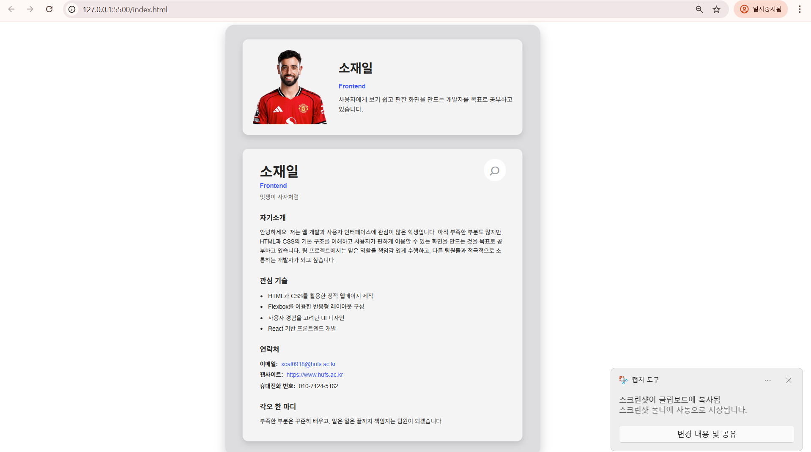

# 📘 Today I Learned

### 1. 오늘 배운 내용
- HTML과 CSS를 분리해서 정적 웹페이지를 만드는 방법을 배웠다.
- 자기소개 요약 카드와 상세 정보 영역을 나누어 구성했다.
- Flexbox를 사용해 이미지와 텍스트를 정렬하는 방법을 배웠다.
- 카드 UI를 만들기 위해 여백, 그림자, 둥근 모서리를 적용했다.

### 2. 핵심 정리 (내 언어로)
- HTML은 구조, CSS는 디자인을 담당한다.
- Flexbox를 사용하면 카드 안의 요소들을 쉽게 정렬할 수 있다.
- 적절한 여백과 크기 조절만으로도 화면이 더 깔끔해진다.

### 3. 결과 이미지(스크린샷)

### 4. 느낀 점
- 더 멋진 화면을 만들기 위해서는 노력해야겠다고 생각했다.