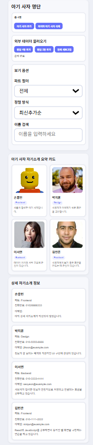

# 📘 Today I Learned

### 1. 오늘 배운 내용
- React에서 useState로 명단, 폼, 필터, 검색 상태를 관리하는 방법을 배웠다.
- useEffect와 fetch를 사용해서 외부 데이터를 불러오는 기능을 구현했다.
- 상태가 바뀌면 React가 화면을 자동으로 다시 그려준다는 점을 배웠다.

### 2. 핵심 정리 (내 언어로)
- DOM을 직접 수정하지 않고, 데이터 상태만 바꾸면 화면이 바뀐다.
- 버튼 클릭, 검색 입력, 필터 선택은 모두 상태 변경으로 연결된다.
- 필터, 정렬, 검색 조건을 적용해서 화면에 보여줄 명단을 결정할 수 있다.

### 3. 결과 이미지(스크린샷)

### 4. 느낀 점
- React에서는 화면을 직접 건드리는 것보다 상태를 잘 관리하는 것이 중요하다고 느꼈다.
- useState와 useEffect를 사용하면서 동적인 화면을 만드는 흐름을 조금 더 이해할 수 있었다.