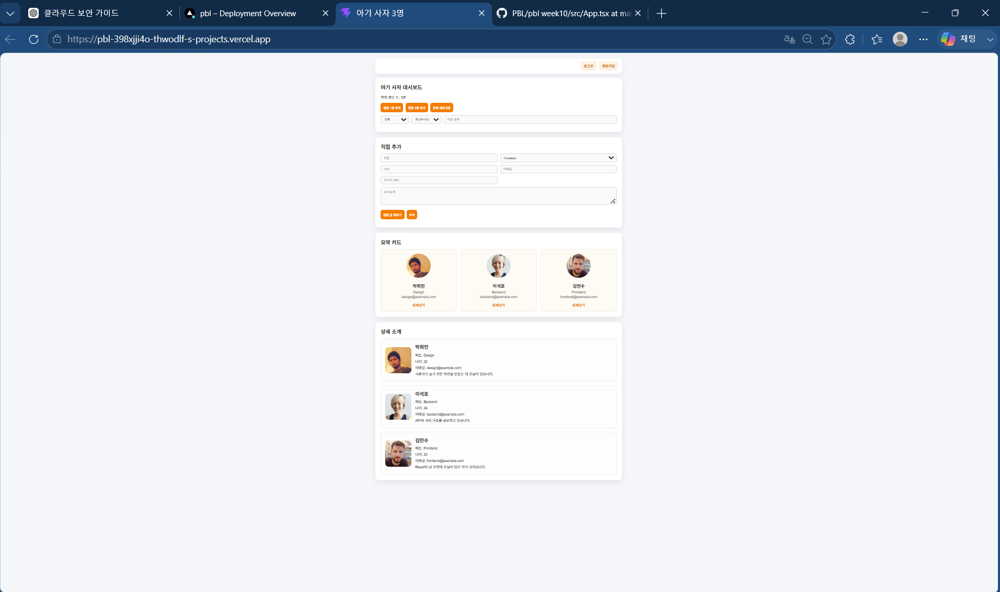
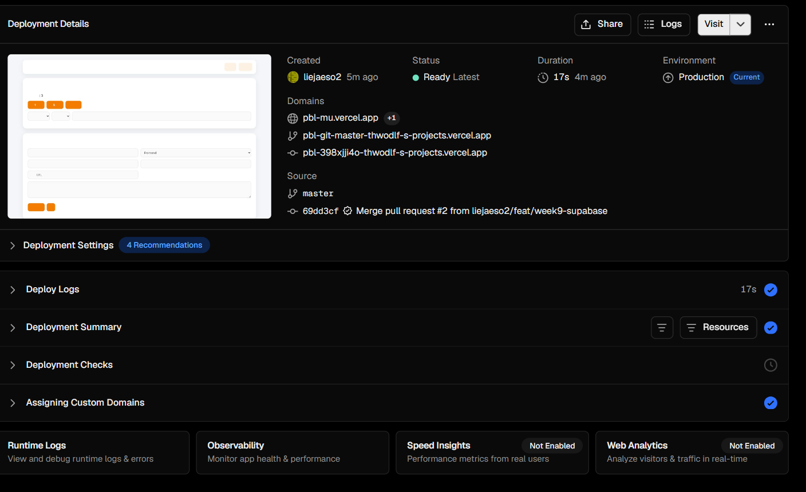

# 📘 Today I Learned

### 1. 오늘 배운 내용
- Vercel을 이용해 React + TypeScript 프로젝트를 실제 URL로 배포했다.
- GitHub 저장소와 Vercel을 연결하여 main/master 브랜치 기준 자동 배포를 설정했다.
- Supabase 환경 변수를 Vercel에 따로 등록해야 배포 환경에서도 정상 동작한다는 것을 배웠다.

### 2. 핵심 정리 (내 언어로)
- yarn dev는 로컬 개발용 실행이고, yarn build는 배포용 파일을 만드는 과정이다.
- Vercel은 GitHub 저장소를 연결하면 코드가 push될 때 자동으로 배포할 수 있다.
- 로컬의 .env.local은 Vercel에 자동으로 올라가지 않기 때문에 환경 변수를 직접 등록해야 한다.
- 배포 후에는 실제 URL에서 로그인, 데이터 조회, 추가, 삭제 기능이 동작하는지 확인해야 한다.

### 3. 결과 이미지(스크린샷)

#### 배포된 서비스 화면

#### Vercel 배포 완료 화면

### 4. 느낀 점
- 로컬에서 정상 동작하던 프로젝트도 배포 환경에서는 환경 변수 설정이 누락되면 제대로 실행되지 않는다는 것을 알게 되었다.
- 오류가 발생했을 때 브라우저 콘솔을 확인하면 원인을 빠르게 찾을 수 있다는 점을 배웠다.
- 이번 과제를 통해 단순 구현뿐 아니라 빌드, 배포, 환경 변수 관리까지 포함해 하나의 서비스를 완성하는 과정을 경험했다.