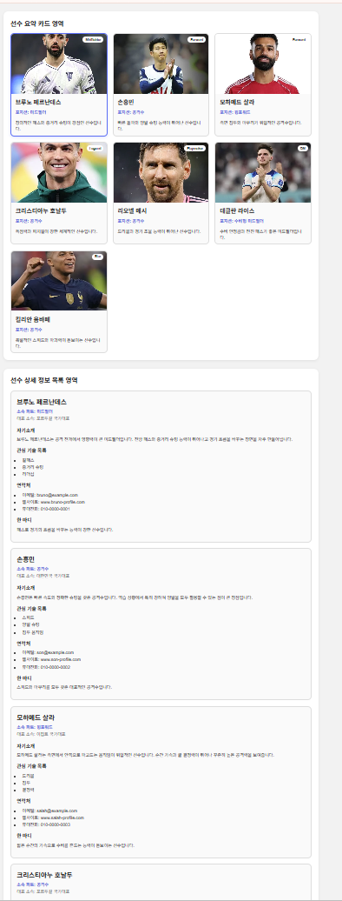
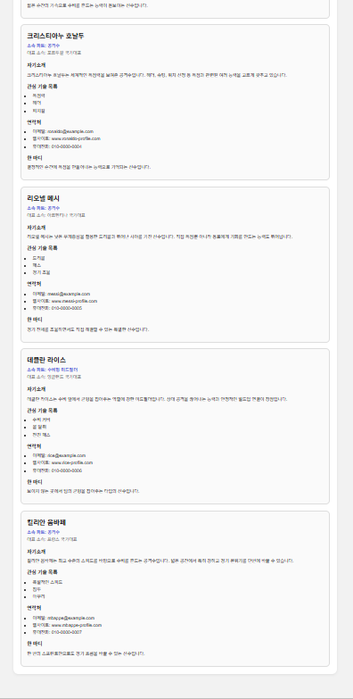

# 📘 Today I Learned

### 1. 오늘 배운 내용
- HTML, CSS로 카드형 레이아웃 만들기
- Grid를 이용한 반응형 카드 배치
- 상세 정보 영역을 세로 목록 형태로 구성하기

### 2. 핵심 정리 (내 언어로)
- Grid는 카드 여러 개 정렬할 때 편하다.
- 반응형은 화면 크기에 따라 열 개수를 바꾸는 방식이다.

### 3. 결과 이미지(스크린샷)

### 4. 느낀 점
- 처음엔 복잡했는데 직접 수정하면서 구조를 이해했다.

