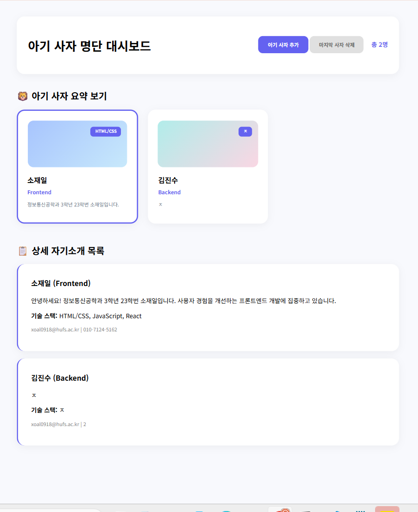

# 📘 Today I Learned

### 1. 오늘 배운 내용
정적인 html에서 자바스크립트를 통해서 동적인 기능을 수행할 수 있는 자바스크립트를 배웠습니다. 
-

### 2. 핵심 정리 (내 언어로)
- 자바스크립트 파일을 별도로 분리해서 관리하니 구현할 수 있는 기능이 훨씬 많아지는 것 같습니다. 웹 개발에서 자바스크립트가 차지하는 비중이 정말 크다는 것을 깨달았고 앞으로 더 집중해서 공부해야겠습니다.

### 3. 결과 이미지(스크린샷)
-
-

### 4. 느낀 점
-복잡한 로직을 어떻게 하면 더 쉽고 효율적인 코드로 짤 수 있을지 꾸준히 연습해봐야겠습니다. 유연한 사고방식을 기르는 연습이 필요할 것 같습니다.
-