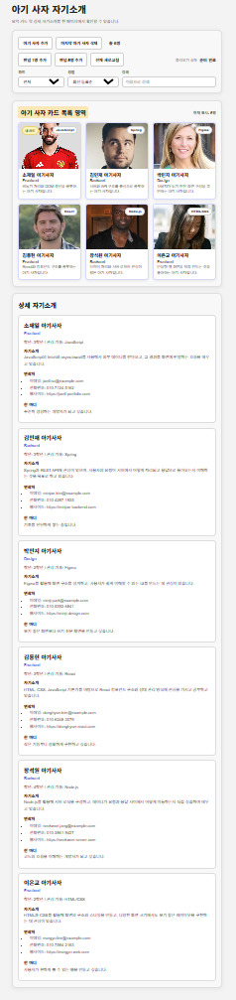

# 📘 Today I Learned

### 1. 오늘 배운 내용
- fetch로 외부 API 데이터를 불러오는 방법을 배웠다.
- async/await로 비동기 요청을 처리하는 방법을 배웠다.
- 배열 데이터를 기준으로 화면을 갱신하는 방법을 배웠다.

### 2. 핵심 정리 (내 언어로)
- 명단을 배열로 관리하고, 추가/삭제/새로고침이 일어나면 화면도 같이 갱신되도록 만들었다.
- 필터, 정렬, 검색 조건에 맞는 데이터만 화면에 보여주었다.

### 3. 결과 이미지(스크린샷)

### 4. 느낀 점
- 데이터를 기준으로 화면을 다시 그리는 흐름이 중요하다는 것을 알게 되었다.