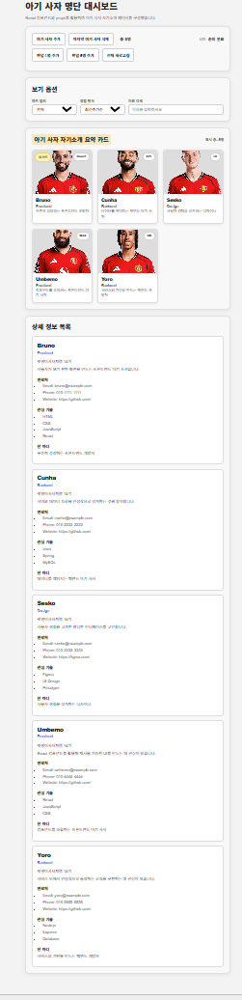

# 📘 Today I Learned

### 1. 오늘 배운 내용
- React에서 화면을 컴포넌트 단위로 나누는 방법을 배웠다.
- JSX 문법으로 화면 구조를 작성하는 방법을 배웠다.
- lions.js 데이터를 가져와 화면에 렌더링하는 방법을 배웠다.
- props를 사용해 부모 컴포넌트에서 자식 컴포넌트로 데이터를 전달하는 방법을 배웠다.

### 2. 핵심 정리 (내 언어로)
- React는 HTML을 한 번에 길게 작성하는 것이 아니라, 역할별 컴포넌트로 나누어 화면을 만든다.
- 같은 카드 구조도 데이터를 바꿔 전달하면 여러 개의 카드로 반복해서 보여줄 수 있다.

### 3. 결과 이미지(스크린샷)

### 4. 느낀 점
- 처음에는 파일 구조와 컴포넌트 분리가 헷갈렸지만, 데이터를 기준으로 화면이 만들어지는 흐름을 이해할 수 있었다.
- React에서 props를 통해 데이터를 전달하는 방식이 중요하다고 느꼈다.