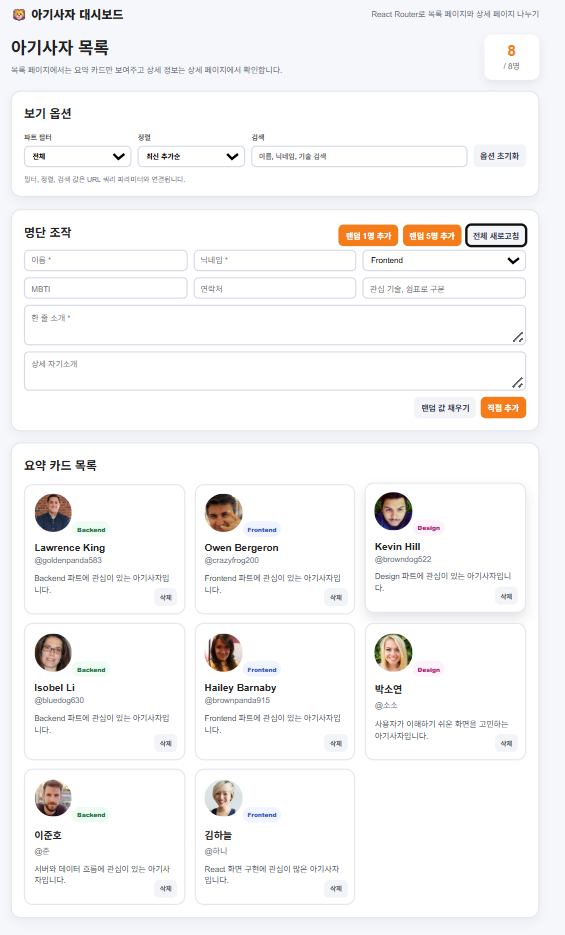

# 📘 Today I Learned

### 1. 오늘 배운 내용
- React Router를 사용해서 목록 페이지와 상세 페이지를 나누는 방법을 배웠다.
- URL 파라미터를 이용해 상세 정보를 보여주는 방법을 배웠다.
- 필터, 정렬, 검색 조건을 URL 쿼리 파라미터와 연결하는 방법을 배웠다.
- 외부 API 데이터를 불러올 때 로딩과 에러 상태를 처리하는 방법을 연습했다.

### 2. 핵심 정리 (내 언어로)
- React Router를 사용하면 한 화면에 모든 내용을 넣지 않고, 목록 페이지와 상세 페이지를 따로 관리할 수 있다.
- 검색이나 필터 값을 URL에 남기면 새로고침을 해도 현재 화면 상태를 유지할 수 있다.
- 데이터를 불러오는 기능은 성공했을 때뿐만 아니라 실패했을 때의 화면도 함께 생각해야 한다.

### 3. 결과 이미지(스크린샷)
#### 목록 페이지

### 4. 느낀 점
- 처음에는 페이지를 나누는 것이 어렵게 느껴졌지만, React Router를 사용하니 목록과 상세 화면을 더 깔끔하게 분리할 수 있었다.
- URL을 이용해서 화면 상태를 관리하는 방식이 실제 웹사이트에서 많이 쓰일 것 같다고 느꼈다.
- 이번 과제를 통해 React에서 페이지 이동과 상세 데이터 표시 흐름을 조금 더 이해할 수 있었다.